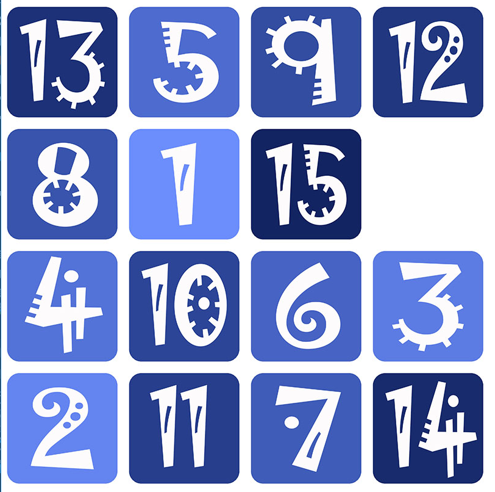
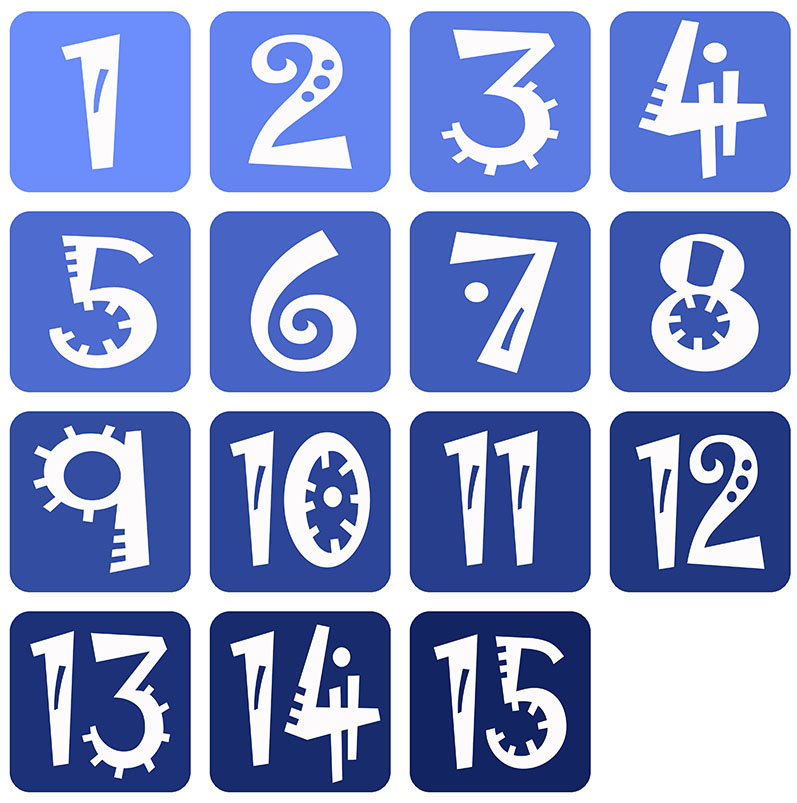

# Klotski
an n-puzzle game with ranking system based on [FriceEngine](https://github.com/icela)
## Game Rule
> The 15-puzzle (also called Gem Puzzle, Boss Puzzle, Game of Fifteen, Mystic Square and many others) is a sliding puzzle that consists of a frame of numbered square tiles in random order with one tile missing. The puzzle also exists in other sizes, particularly the smaller 8-puzzle. If the size is 3×3 tiles, the puzzle is called the 8-puzzle or 9-puzzle, and if 4×4 tiles, the puzzle is called the 15-puzzle or 16-puzzle named, respectively, for the number of tiles and the number of spaces. The object of the puzzle is to place the tiles in order by making sliding moves that use the empty space.

> The n-puzzle is a classical problem for modelling algorithms involving heuristics. Commonly used heuristics for this problem include counting the number of misplaced tiles and finding the sum of the taxicab distances between each block and its position in the goal configuration. Note that both are admissible, i.e. they never overestimate the number of moves left, which ensures optimality for certain search algorithms such as A*.  

> from [wikipedia](https://en.wikipedia.org/wiki/15_puzzle)  

This game here is 15-puzzle particularly.
- Initially, the players would receive a 16-space room with 15 of them are filled with number ranged from 1 to 15.
  
- Later, the players would be required to slide those available square tiles using up, down, left, and right arrow. And the ultimate goal of all players of all time is to reach the following format:
  
The number of steps taken would be recorded and if a record now ranks at top 10, it would be displayed next time when playing it.
## How to Build
- To build the game, players need first add the [FriceEngine](https://github.com/icela/FriceEngine) in their project.  
- Secondly, players need to run the Klotski.java in /src.
